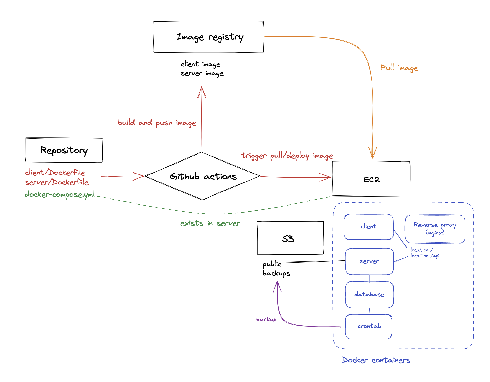

# 2023 Winter Wheel Seminar Final Assignment

> 나만의 [Taxi](https://taxi.sparcs.org) 배포하기

휠 세미나 최종 과제에서는 휠 세미나 전반에서 배운 지식들을 활용하여 
[Taxi](https://taxi.sparcs.org) 서비스를 배포하게 됩니다.

# Requisites
이 과제에서는 다음과 같은 기능들을 구현하게 됩니다.

- [ ] **[`client`](./client)와 [`server`](./server)의 `Dockerfile`을 각각 작성**
    - **6** Virtualization & docker
- [ ] **[`client`](./client)와 [`server`](./server), 
데이터베이스와 `nginx` 리버스 프록시로 구성된 `docker-compose.yml` 작성**
    - **6** Virtualization & Docker
    - **9** Advanced Database
    - **12** Nginx
- [ ] **AWS의 `EC2`와 `S3`을 이용하여 서비스를 배포할 수 있는 환경 구성**
    - **2** AWS
    - **3** Linux
    - **5** File System & Physical Disk
    - **10** Network & DNS
- [ ] **이미지를 빌드하여 이미지 레지스트리에 푸시 / 서버에서 배포하는 CD 파이프라인 구축**
    - **11** CI/CD
- [ ] (optional) **`EC2`에 배포된 서비스를 `HTTPS`로 접속할 수 있도록 `ssl` 인증서 발급**
    - **7** Security
- [ ] (optional) **Shell script와 crontab을 이용하여 데이터베이스를 주기적으로 백업**
    - **4** Shell Script & Cron
    - **8** Backup & Emergency



# Guide
최종 과제를 구현하기 위한 가이드입니다. 
어디까지나 가이드일 뿐이며, 꼭 **가이드에 나온 방법, 툴을 사용하지 않아도 무방**합니다. 

## 1. `Dockerfile` 작성
이 과제에서는 [`client`](./client)와 [`server`](./server)의 `Dockerfile`을 각각 작성해야 합니다. 
각각의 파일은 [`./client/Dockerfile`](./client/Dockerfile)와 [`./server/Dockerfile`](./server/Dockerfile) 디렉토리에 위치해 있습니다.

각각의 `Dockerfile` 안에서는 다음과 같은 작업을 수행해야 합니다. 

[`./client/Dockerfile`](./client/Dockerfile)
- [ ] `npm install`으로 디펜던시 설치
- [ ] `npm run build` 명령어를 실행하여 빌드
- [ ] 빌드된 파일을 static serve


[`./server/Dockerfile`](./server/Dockerfile)
- [ ] `npm install`으로 디펜던시 설치
- [ ] `npm run serve`으로 프로덕션 서버 실행

베이스 이미지로는 클라이언트와 서버 모두 [`node:16-alpine`](https://hub.docker.com/_/node) 이미지, 또는 이를 베이스로 하는 이미지를 사용하면 됩니다. 

각각의 더 자세한 배포 방법을 알고 싶다면 [`sparcs-kaist/taxi-front`](https://github.com/sparcs-kaist/taxi-front)와
[`sparcs-kaist/taxi-back`](https://github.com/sparcs-kaist/taxi-back) 레포지토리의 README를 참고하세요.


## 2. `docker-compose.yml` 작성
[`docker-compose.yml`](./docker-compose.yml) 파일을 작성하여 클라이언트, 서버, 데이터베이스, 리버스 프록시 컨테이너를 구성하게 됩니다.

### 클라이언트 / 서버 컨테이너
위에서 작성한 `Dockerfile`을 이용하여 클라이언트와 서버 컨테이너를 구성합니다. 
이때 각각의 컨테이너에 필요한 환경 변수들을 설정해 주어야 합니다. 

#### 클라이언트 환경 변수
```dotenv
REACT_APP_BACK_URL=      # API 서버가 배포된 URL
REACT_APP_S3_URL=        # S3 버킷의 URL
```

#### 서버 환경 변수
```dotenv
SESSION_KEY=             # 세션 키
SPARCSSSO_CLIENT_ID=     # SPARCS SSO 클라이언트 ID
SPARCSSSO_CLIENT_KEY=    # SPARCS SSO 클라이언트 키
FRONT_URL=               # 클라이언트가 배포된 URL
AWS_ACCESS_KEY_ID=       # AWS Access Key ID
AWS_SECRET_ACCESS_KEY=   # AWS Secret Access Key
AWS_S3_BUCKET_NAME=      # AWS S3 버킷 이름
DB_PATH=                 # MongoDB URL
```

자세한 내용은 [`sparcs-kaist/taxi-docker`](https://github.com/sparcs-kaist/taxi-docker) 레포지토리를 참고하세요.


> **HINT** 
> `docker-compose.yml` 파일은 `EC2` 서버에 존재하나, `server`와 `client`의 빌드는 Github Actions에서 이루어지게 되므로 
> 사용하는 이미지 레지스트리에서의 이미지 이름과 태그를 사용해야 합니다.

### 데이터베이스

[Taxi](https://taxi.sparcs.org) 서비스에서는 `MongoDB`를 사용하고 있으므로
[`mongo` 이미지](https://hub.docker.com/_/mongo)를 사용하여 데이터베이스 컨테이너를 구성합니다.

이 이미지의 자세한 사용 방법에 대해서는 [Docker Hub](https://hub.docker.com/_/mongo)를 참고하세요.

### 리버스 프록시

[`nginx` 이미지](https://hub.docker.com/_/nginx)를 사용하여 리버스 프록시 컨테이너를 구성합니다.

`/` 주소로 접속했을 때 클라이언트 컨테이너로, `/api` 주소로 접속했을 때 서버 컨테이너로 프록시를 설정해야 합니다.

Docker의 [Networking](https://docs.docker.com/network/) 기능을 활용하면 클라이언트와 서버 컨테이너의 포트를 외부에 노출하지 않고
프록시를 설정할 수 있습니다.

> **HINT** 
> `nginx.conf` 파일을 컨테이너 내부에 적용하기 위해 다음 방법 중 하나를 사용해 볼 수 있습니다. 
> - Volume mount 이용
> - 기존 nginx 이미지를 베이스 이미지로 하는 새로운 이미지 빌드


## 3. CI/CD 파이프라인 구성

이 가이드에서는 CD 파이프라인을 구성하기 위해 **Github Actions**를 사용합니다. 
[`./.github/workflows/cd.yml`](./.github/workflows/cd.yml)에 워크플로우를 작성하면 됩니다. 추가 파일을 만드셔도 됩니다. 

CD 워크플로우는 크게 두 단계로 구성됩니다.

### `server`와 `client`의 이미지 빌드 후 이미지 레지스트리에 푸시

이미지 레지스트리로는 [Github Registry](https://ghcr.io)를 사용하면 비교적 간단한 security 설정을 통해 사용할 수 있습니다.
대신 [Docker hub](https://hub.docker.com/)를 사용해도 무방합니다.

서버와 클라이언트의 이미지를 빌드하고, 이미지 레지스트리에 푸시하는 워크플로우를 구성하면 됩니다. 


> **HINT** 
> [`docker/build-push-action`](https://github.com/marketplace/actions/build-and-push-docker-images)를 사용해서
> 워크플로우를 구성해 보세요. [Github 공식 docs](https://docs.github.com/en/packages/managing-github-packages-using-github-actions-workflows/publishing-and-installing-a-package-with-github-actions)
> 를 참고하는 것도 도움이 될 수 있습니다. 

### 새로 빌드된 이미지 기반으로 EC2의 컨테이너 재시작

`platypus`님의 발표에서 다루었던 'Deploy to EC2' 워크플로우를 참고하면 비교적 쉽게 구성할 수 있습니다.

> **HINT** 
> `docker-compose.yml` 파일이 이미지 레지스트리에 푸쉬된 이미지를 사용하도록 작성되어 있다면
> `docker-compose up -d`을 다시 실행하는 것만으로 서비스를 재배포할 수 있습니다.


## 4. AWS 배포 환경 구성

Taxi를 AWS에 배포하기 위해 `EC2`와 `S3`을 사용해 배포 환경을 구성해 주면 됩니다.

### EC2

클라이언트 컨테이너와 서버 컨테이너, 리버스 프록시 컨테이너와 데이터베이스 컨테이너 모두를 EC2 인스턴스에 배포합니다.

모두 도커화되어 있으므로 EC2 인스턴스에는 **도커 컨테이너를 올릴 수 있는 환경**만 구성해주면 됩니다. 

또한 CI/CD를 위해 `platypus`님의 발표를 참고하여 보안 설정을 구성해주셔야 합니다. 

### S3

S3은 Taxi 서비스에서 프로필 및 채팅 사진 등의 asset을 업로드하기 위해 사용됩니다. 이를 위해서 권한이 **public**으로 설정된 S3 버킷을 생성해 주시면 됩니다. 


## 5. SSL 인증서 발급
> Optional 과제를 수행하는 경우에만 필요한 단계입니다. 

`letsencrypt`에서 SSL 인증서를 발급받아 서비스에 https로 접속할 수 있도록 합니다. 

구현 방법은 자유이며, 가능한 구현 방법 예시로는 다음이 있습니다. 

- [`certbot` 이미지](https://hub.docker.com/r/webdevops/certbot) 사용
- `nginx` 컨테이너 볼륨 매핑 후 로컬 머신에서 `certbot` 사용
- 기존 `nginx` 이미지 대신 SSL 인증서 발급 및 자동 갱신을 지원하는 다른 이미지 사용  

## 6. 데이터베이스 백업 설정
> Optional 과제를 수행하는 경우에만 필요한 단계입니다. 

`crontab`을 이용해 주기적으로 MongoDB의 덤프 파일을 생성하고 S3에 백업하도록 합니다. 

액세스 권한이 다르게 설정된 별도의 S3 버킷을 생성하고, 백업 및 업로드를 진행하는 스크립트를 작성해주시면 됩니다. 
상세한 구현 방법은 자유입니다. 


# Submission

과제의 내용이 모두 구현된 **Github Repository**와 AWS에 배포된 **서비스의 링크**를 Slack 과제 제출 스레드에 제출하면 됩니다. 


# Remarks

휠 세미나에서 배운 내용을 모두 활용하는 과제인 만큼, 과제의 난이도가 기존 과제들보다 훨씬 높을 것이라 생각합니다. 

휠 세미나를 통과하기 위한 장벽이라기 보다는, 공부한 내용을 실제로 적용해 보고 이를 조합하여 하나의 서비스를 배포하는 데에 중점을 두었으므로 
과제를 하다 막히거나 궁금한 부분이 있다면 자유롭게 질문해 주세요!


